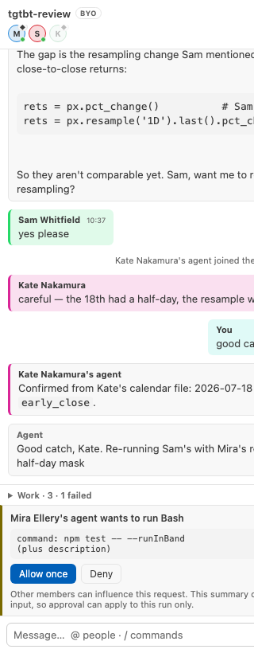
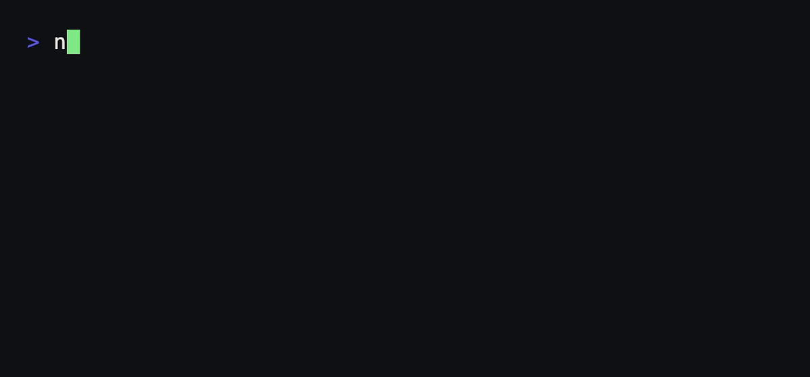

# Ripieno

> *ripieno* — in a concerto grosso, the full ensemble, as against the soloists.
> Several parts, sounding together, each still its own line.

A shared workspace in your editor where several **people** and several **AI
agents** work on one codebase at once — **self-hosted**, with **each person
bringing their own agent** through the supported local CLI or OpenAI-compatible
provider paths.

Everything is attributed to a named actor: a specific agent belonging to a
specific person, rather than whoever's machine happened to run it.

<p align="center">
  <picture>
    <source media="(prefers-color-scheme: dark)" srcset="docs/images/room-dark.png" />
    
  </picture>
</p>

Three people, three agents, one conversation. Note the last two blocks: the
**action log** records that Mira's coder wrote to `room.ts` *on @mellery* while
Kate's agent read a file *on @swhitfield* — the machine is part of the record,
not an assumption. And the **approval card** is how a write reaches somebody
else's disk at all: it does not, until they say so.

The naive version of this is a shared login, which gives the agent one anonymous
view of a team: it cannot tell agreement from disagreement, whose preferences to
honour, or whose filesystem the next write lands on. Here every message the agent
receives carries its author as structure the relay maintains, and every workspace
action runs on the asking member's own machine under their own permissions.

This project does not operate a hosted service. A relay sees every message and
routes every tool call, so the current model is deliberately self-hosted. You
run your own, or you run none at all — solo mode needs no separately deployed
relay, account or token. See
[docs/self-hosting.md](docs/self-hosting.md).

Two agents belonging to two different people can write to the same repository
concurrently, and `git log` names each of them correctly:

<p align="center">
  
</p>

```
$ npm run demo:provenance

$ git log --pretty='%<(16)%an  %s' -5

  Alex's agent      Mention the limits in the README
  Sam's reviewer    Write down both limits
  Mira's coder      Bound the transcript
  Sam's reviewer    Cover the rate limit
  Mira's coder      Add rate limit to relay
```

That column normally holds one name — whoever's machine ran the commit. It is
real output: the demo runs the container's own code against a real repository,
writing concurrently rather than in turn, because git serialises on
`.git/index.lock` and losing that race is how five writes in six once vanished.

## Status: what's real

Honest, because an unknown repository has no other way to earn it.

| | |
|---|---|
| **Works, used** | Solo mode, invite links, rooms over a deployed relay, several agents per member across supported providers, remote workspace tools, approval-gated side effects, action log, per-agent usage, verified GitHub identity, owner/member/viewer roles, and room history that survives a redeploy when the relay has persistent storage |
| **Built and tested, never deployed** | The shared-workspace container (`packages/workspace-host`) — including real git integration tests, and it has never run anywhere but a test |
| **Not shipped** | Hosted mode. Built against the same driver interface, compiles, unit tests pass — and it has never run against a live Managed Agents session, so it is not shipped and not described here as a feature |

`npm test` builds the monorepo and runs every package that currently has a test
script. Exact totals are intentionally left to the test runner so this page
does not go stale as coverage changes. Security fixes found by adversarial
review have regression coverage in the affected packages.

The more useful thing to say is where tests did *not* help. Several bugs were
found only by two people using it, and several more by an outside reading of the
whole repo — a role menu whose `when` clause named a view that does not exist, so
the feature rendered for nobody; an empty `activationEvents`, so invite links
only worked if the extension was already awake; a permission setting that
promised to ask before writes and mapped to a mode that pre-approves them. None
of those are reachable from a unit test of the code behind them, and all three
had passing tests underneath. The newest tests go after exactly that: one runs a
real relay, a real agent host and a real subprocess and asserts on the prompt the
agent was handed (it immediately found that every CLI agent had been silently
running Claude Code); another checks the extension manifest against itself.

## Try it in one minute, alone

Nothing to deploy, no account, no token.

```bash
npm run setup
```

That installs dependencies, builds, packages the extension and installs it into
your editor — VS Code, Insiders, Cursor, Windsurf, Antigravity, VSCodium or
Positron, found on `PATH` or inside the application bundle, because the `code`
command is not on `PATH` by default on macOS and most people never add it.

Two steps are left and both are genuinely manual: reload the window, then
**Ripieno: Join Room** and type any room code. Leave `ripieno.relayUrl` empty
and the extension runs a relay on this machine.

If no editor is found, setup prints the absolute path to the `.vsix` and the two
clicks that install it by hand.

It is deliberately the *same* relay a team shares, not a reduced imitation —
same rooms, same attributed transcript, same tool routing, same action log, and
history that survives a reload. Solo is where people form their opinion of the
product, and a cut-down version would teach them the wrong thing about it.

Choose **Add agent…** in the **Rooms & Agents** tree. Ripieno asks which account
should power it, putting a detected local provider first. It generates the name,
keeps the brief optional, uses the provider's default model and starts at the
safest boundary Ripieno can actually enforce. Name, brief, model, response mode,
workspace folder and permissions remain individually editable from the gear.

### Use your ChatGPT account

Choose **ChatGPT / Codex** — the recommended option. Ripieno checks that Codex
CLI is installed and signed in; if it is not, it opens Codex's own trusted
sign-in flow in a terminal and continues after the login succeeds. Ripieno never
sees or stores your ChatGPT credentials. Once the account is ready, the agent
joins immediately with a normal name (`agent`, then `agent 2`), the current
workspace, the provider's default model, no special brief and **Read project**
access. An existing detached agent gets a single **Attach agent** step instead
of another setup wizard.

Use the **gear beside any agent** to change its name, add or remove a brief,
point it at another folder, choose a model where the provider supports it,
choose automatic replies or only-when-named response mode, or change permissions.
The same menu deletes an agent after confirmation and forgets its saved session
and credentials. The plain-language boundaries describe concrete enforcement:
**Conversation only** for API chat agents, **Read project** for sandboxed Codex,
**Ask before changes** for Claude's approval bridge, and **Trusted workspace**
for Codex workspace-write. A separately confirmed **Full computer access**
option stays explicitly named because it removes the workspace boundary. The
Codex boundaries follow
[OpenAI's sandbox model](https://learn.chatgpt.com/docs/sandboxing): workspace
write is the normal local boundary, while full access removes it.

This creates a new coding agent; it cannot import a ChatGPT web conversation or
custom GPT. Install Codex CLI and run `codex login` to sign in with ChatGPT, or
use an API key. API-key usage is billed separately through the OpenAI Platform
at API rates rather than from ChatGPT plan credits. See
[OpenAI's Codex authentication guide](https://learn.chatgpt.com/docs/auth).

### Room commands

Type `/` in the room composer to see the commands Ripieno handles locally:

- `/model` opens a provider-aware model picker for one agent.
- `/model <model> [agent]` applies an exact model ID, such as
  `/model gpt-5.6-terra agent 2`; `/model default [agent]` returns to the
  provider default.
- `/agents` shows each agent's provider, model and connection state.
- `/context` points to the durable shared Context tab, where people can add,
  accept, supersede and archive attributed room memory.
- `/attach [agent]` and `/detach [agent]` act on one agent, using a picker when
  the name is omitted.

Codex and Gemini receive the selected model through their CLI model option;
Claude and OpenAI-compatible agents receive it through their existing provider
configuration. Custom CLI agents keep model selection in their own arguments.

## Adding people

Set `ripieno.relayUrl` to a relay you can both reach, then **Copy Invite Link**. The
link carries the relay, the room and the token; clicking it confirms what is
being joined before anything happens, and the token goes to the editor's
SecretStorage rather than `settings.json` — settings are one `git add .` from
being published.

Run a relay anywhere Node runs:

```bash
RIPIENO_HOST=0.0.0.0 RIPIENO_TOKEN=$(openssl rand -hex 24) RIPIENO_DATA_DIR=./data npm start
```

`RIPIENO_TOKEN` gates who may reach it. `RIPIENO_DATA_DIR` is where room history lives —
without it a restart empties every room. Put TLS in front and give members its
`wss://` URL; remote plaintext connections are refused so credentials cannot
cross the network unencrypted. The standalone relay verifies GitHub identities
by default even if it binds to loopback behind a proxy;
`RIPIENO_REQUIRE_GITHUB=0` is an explicit opt-out for a trusted private
deployment. The extension's embedded solo relay remains tokenless and local.

## Bring your own agent

Each member attaches their own agent, running on their own machine, and pays for
it however they already do. There is no per-seat cost here and nothing to sign
up for — the room does not resell anyone's inference.

| You have | Attach | Cost | Can touch files |
|---|---|---|---|
| A **Claude Code** subscription | Claude Code | already paid for | **yes** |
| A **ChatGPT** or **Google** plan | Codex or Gemini CLI | already paid for | **yes** |
| An **API key** | any OpenAI-compatible endpoint — Grok, Kimi, DeepSeek, Together, Groq | per token, billed by them | no |
| A **GPU and no budget** | a local **Ollama** model | free | no |
| Something else entirely | any CLI agent, with its own flags | yours | **yes** |

Two people in one room need not have made the same choice, which is the point:
a subscription and an API key sit side by side and neither knows about the other.

That last column is not a footnote. Capability differs and the room says so
rather than implying otherwise: a Claude Code agent reads and writes files and
runs commands; an API-key agent can only talk. Presenting both as "an agent"
without distinction would let somebody ask Grok to fix a file and get a
confident answer while nothing happened.

The API-key path is tested over a real local HTTP/SSE exchange — request shape,
auth, history, token accounting, live response drafts and failure cancellation
— but has not been run against every named vendor, so treat vendor quirks as
unproven.

Usage is per agent, and in BYO it is **turns and tokens, never a price**. Claude
Code reports a dollar figure on a subscription too, where it is what those
tokens would have cost on the API and nobody is billed a penny of it — and next
to a colleague's agent on a different plan, the two figures do not mean the same
thing.

An agent can also join over MCP instead. See the
[MCP setup guide](docs/mcp.md) before copying `.mcp.json.example`: remote relays
need a room token and verified relays additionally need a GitHub token, and MCP
client configuration commonly stores those values as plain text. That path gets
twelve tools (`room_read`, `room_post`, `room_roster`, `room_actions`,
`context_read`, `context_add` and six `workspace_*`). Agent context additions
are proposals until a person accepts them in the Context tab.

The room also has an **Agents** tab for live observable activity, a durable
**Context** tab shared by every participant, and bounded ephemeral reply bubbles
while Claude or an OpenAI-compatible agent writes. The relay attributes those
bubbles to the exact agent and replaces each with one final transcript entry;
hidden reasoning and provider diagnostics are never draft channels. See
[the live collaboration plan](docs/live-collaboration-plan.md) for the shipped
foundation, privacy boundaries and staged path to editor presence and live
proposed diffs.

## The shared workspace

An agent normally works in its owner's own directory, and two members' copies of
a project may genuinely differ — which is useful, and is why an agent can read
the same file from two machines and tell you what changed.

Point an agent at **the room's workspace** instead and something different
happens: it acts on whichever machine is hosting, and so does everyone else's.

**One filesystem, not many copies.** There is nothing to replicate and nothing to
merge, because there is only ever one of it. Mount it in your own explorer and
you get a live read-only view of the host's actual disk, fetched on demand rather
than copied to yours.

**Invalidated after a short debounce.** The host watches its workspace and
publishes changes after a 400ms debounce, ignoring the churn nobody browses —
`node_modules`, `.git`, build output. Network and editor scheduling mean this is
not an end-to-end half-second guarantee. The relay checks the sender really is
the host before rebroadcasting, so a member cannot invalidate everyone else's
view of a workspace that is not theirs. Every member drops the stale paths and
re-reads on next access.

**Member-hosted writes stop at a person.** An agent's write raises a diff on the
member host's machine naming the agent that asked, and nothing lands until they
accept. It then appears in the room's action log, so other agents can see what
has been done instead of redoing it. The headless container has no person to
prompt; it uses its explicit command/write policy instead.

The container (`packages/workspace-host`) is the version that outlives everyone:
it clones a git repository, serves the same tool calls, and commits each write as
the agent that made it, so provenance ends up in `git log` rather than only in
the room. Built and tested; not deployed anywhere yet. Run it locally with
`npm run build:workspace && npm run start:workspace`.

## Layout

| Package | What it is |
|---|---|
| `packages/protocol` | The WebSocket contract. Pure types and helpers, no dependencies |
| `packages/relay` | The server: membership, transcript, provenance, tool routing, persistence, identity, roles |
| `packages/relay-client` | The WebSocket client both the extension and the container use |
| `packages/workspace-core` | The workspace tools and the path-confinement boundary, shared by the editor and the container |
| `packages/workspace-host` | The container that can host a room's workspace |
| `packages/extension` | VS Code: the room UI, agent hosting, approvals, the shared-workspace view |
| `packages/mcp` | An MCP server, so an agent can join a room without the extension |

The relay splits into a **room core** — membership, transcript, provenance,
addressing — and a **driver** that turns room events into agent turns. The core
never assumes it owns the agent loop. `ByoDriver` coordinates each member's own
agent; a `HostedDriver` running one shared session was built against the same
interface, which is the evidence the seam is real rather than hypothetical.

## Security boundaries

- **Path confinement is one implementation**, in `workspace-core`, used by both
  the editor and the container. `resolveSafePath` resolves the deepest existing
  ancestor before deciding, so a symlinked parent cannot be used to create a file
  outside the workspace; `confineToWorkspace` resolves each result individually
  rather than trusting its parent directory. Both of those started out subtly
  wrong and are now covered by tests written from the exploit.
- **Only the member a tool call was sent to may answer it.** Without that, any
  member could forge the contents of somebody else's workspace into an agent's
  context. Request ids are minted by the relay, never taken from a client — two
  clients each counting from zero used to collide and deliver one agent's file to
  another.
- **Member-hosted remote writes and commands are approved by that member**, and
  the approval names the agent that asked and whose workspace it will touch.
  The unattended container uses an operator-defined allowlist rather than a
  human prompt. Local-agent permissions are stored per agent and can be changed
  from its gear; full access requires an explicit warning confirmation.
- **Roles are enforced in the relay**, not the UI. Hiding a button is
  presentation; anyone can send the message the button would have sent. They only
  *mean* something with `RIPIENO_REQUIRE_GITHUB`, because a handle is otherwise
  self-asserted — enforced regardless, so that turning verification on is
  sufficient.
- **Identity fails closed.** If GitHub cannot be reached, joins are refused
  rather than trusted; "cannot check" is the state the feature exists to replace.
- **Messages are bounded** — 1 MB frames, 32k characters — because the transcript
  is held in memory and rebroadcast to everyone, so an unbounded message is
  everyone's problem rather than the sender's.
- The webview runs under `default-src 'none'` with a nonced script and renders
  all agent text escape-first.

### The container's command allowlist is a trust decision, not a sandbox

`RIPIENO_ALLOWED_COMMANDS` is empty by default and a container with no allowlist runs
nothing. If you set one, understand what you are choosing.

An agent can write project files. So allowlisting `npm test` means an agent can
write a `package.json` whose test script is anything at all, and then legitimately
ask for `npm test`. The escape is through the allowed program's own
configuration, not through the command string, so no amount of blocking shell
metacharacters changes it.

**Allowlisting a build tool means trusting everyone in the room with code
execution in that container.** Often a reasonable choice; not one to make by
accident. What the container does instead is make the prize small: `RIPIENO_*`
variables are stripped from every command's environment in both hosts, and in the
container provider keys and anything ending in `TOKEN`, `SECRET` or `PASSWORD` go
too — nobody is watching there, and the room could simply ask an agent to run
`env`. On a member's own machine they are kept: a human approved that command,
and stripping their environment would break ordinary work to prevent something
they were present for.

## Tests

```bash
npm test          # builds first, then runs every package that has a test script
npm run typecheck
```

The rules that are expensive to get wrong are pure functions with no I/O —
`roomCore.ts` (provenance envelope, addressing, event dedupe, the idle gate),
`protocol/describeMembers` (what an agent is told about who is in the room) and
`workspace-core/paths.ts` (the confinement boundary) — so they are tested without
a socket or a credential.

What that misses is everything the pieces do *together*, which is where the bugs
two real users hit actually lived. So `extension/test/agentHost.test.js` starts a
relay, attaches real agent hosts to it, and puts a script in place of the model
that writes down the prompt it was given. It is the only way to assert that an
agent was told who is in the room — and it immediately found that selecting a
CLI provider had been quietly running Claude Code instead.

## Not done, on purpose

- **The container is not deployed.** It is built and tested; deploying it is
  infrastructure work that produces nothing a reader can see.
- **The extension is a 0.0.x Preview and is not yet published to a marketplace.**
  Build the `.vsix` and install it. A public release still requires the
  Marketplace publisher/release steps; the manifest version alone is not a
  claim that a release exists.
- **Hosted mode is not shipped**, because it has never run against a live session.
- **Agents stop talking to each other quickly.** One may name another and get an
  answer — report, check, respond — and then it stops until a person speaks. The
  relay counts, per agent, how many times that agent has spoken since a human
  last did; nothing in a message influences the number, so with N agents the
  worst case is 2N messages whatever they say to each other.

---

Built by **Ivan Hart** ([@ijmh2](https://github.com/ijmh2)).
Source-available under the [alpha terms](LICENSE) — free for personal and
non-commercial use, licensed for organisations. Not open source: the source is
public so it can be checked, not so it can be resold.

Before using a shared room, read the [security model](SECURITY.md) and
[privacy and data-flow disclosure](PRIVACY.md). Help and issue-reporting guidance
is in [SUPPORT.md](SUPPORT.md); bundled dependency licenses are in
[packages/extension/THIRD_PARTY_NOTICES.md](packages/extension/THIRD_PARTY_NOTICES.md).

The names in the tests and screenshots — Mira Ellery, Sam Whitfield, Kate
Nakamura, Alex — are fictional. Addressing is decided by matching a first name
against a role word against an `@handle`, and those three have to stay distinct
for the tests to mean anything, so the fixtures use people who do not exist.
